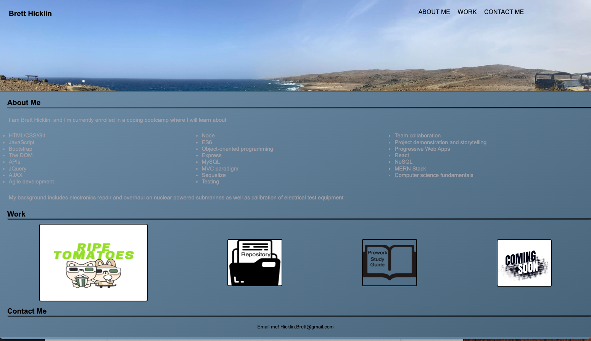

# Brett Hicklin's Portfolio website

## Description

This website was created to act as my portfolio, and to also show what I've learned so far in HTML and CSS. I wanted to make the website look as presentable as I could given my knowledge, so that I can update  it as I learn more about coding,and have a good starting point. I will hopefully be able to expand my "Work" collection to more impressive objects.

## Usage

You can run this website locally by using VScode's live server plugin. Right click on index file and select `Open with live server`

This website can also be ran on Github Pages using the following link [Brett Hicklin's Portfolio website](https://brett-hicklin.github.io/brett-hicklin-portfolio-website/)

Here is a screenshot of the website 

